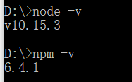

## 新建vue项目的具体步骤

1.首先安装node

进入[官网](https://nodejs.org/en/download/current/)下载与电脑相匹配的版本，安装完成后，打开命令行输入` node -v `,出现版本信息表示安装成功。npm包管理器，是集成在node中的，所以，直接输入 ` npm -v `就会如下图所示，显示出npm的版本信息。

2.由于有些npm有些资源被屏蔽或者是国外资源的原因，经常会导致用npm安装依赖包的时候失败，所以还需要npm的国内镜像---cnpm。在命令行输入` npm install -g cnpm registry=http://registry.npm.taobao.org `.

3.安装vue-cli，命令行输入` cnpm install -g vue-cli `.

4.安装webpack,` cnpm install webpack-g `

5.选择路径，cd目录路径，新建项目，命令行输入` vue init webpack 项目名称 `,完成项目的相关配置，一般默认都选yes。完成后进入文件夹，可以看到项目结构如下：

6.启动项目，下载依赖。进入项目目录，命令行下输入` cnpm install `,和` npm run dev `,项目启动成功后，可以在浏览器输入网址
